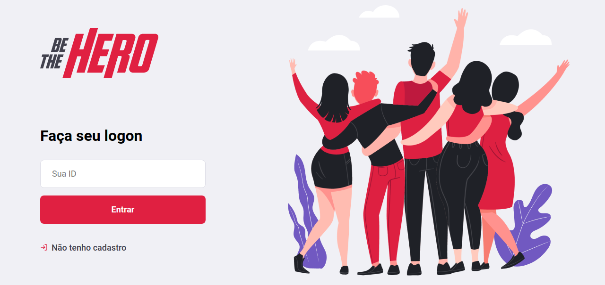
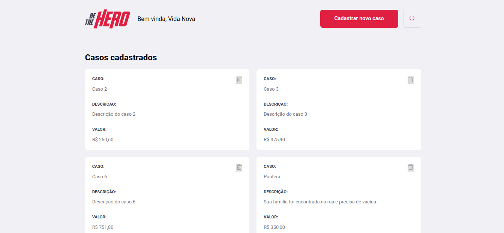

<h1 align="center">
    
</h1>

<h4 align="center"> 
	:construction: 🚀 Semana OmniStack 11.0
</h4>

 

## :rocket: Tecnologias

Este projeto foi desenvolvido com as seguintes tecnologias:

- [Node.js](https://nodejs.org/en/) 
- [React](https://reactjs.org/)
- [React Native](https://facebook.github.io/react-native/)
- [Expo](https://expo.io/)

## 💻 Projeto

O Be The Hero é um projeto que visa conectar pessoas dispostas a ajudar ONGs.

<h1 align="center">
    
</h1>

## 🔖 Layout

<h1 align="center">
    
</h1>

## 🤔 Como contribuir

- Faça um fork;
- Crie uma branch com sua feature: `git checkout -b my-feature`;
- Faça commit das suas alterações: `git commit -m 'feat: My new feature'`;
- Faça push para sua branch: `git push origin my-feature`.

Depois que seu merge for aceito, você poderá excluir sua branch.

## :memo: Licença

Este projeto está sob a licença MIT. Consulte o [LICENSE] (LICENSE.md) para obter detalhes.

---

Feito com ♥ por Samuel Cruz :wave: [Fale comigo!](https://samuel-cruz.github.io/)
